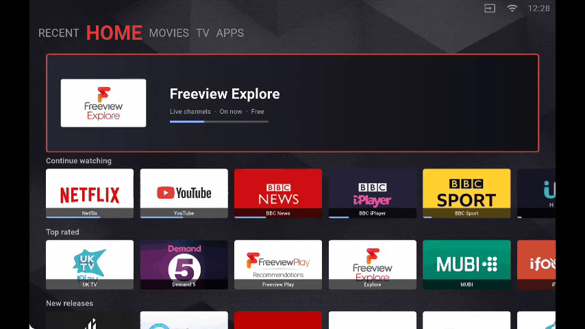
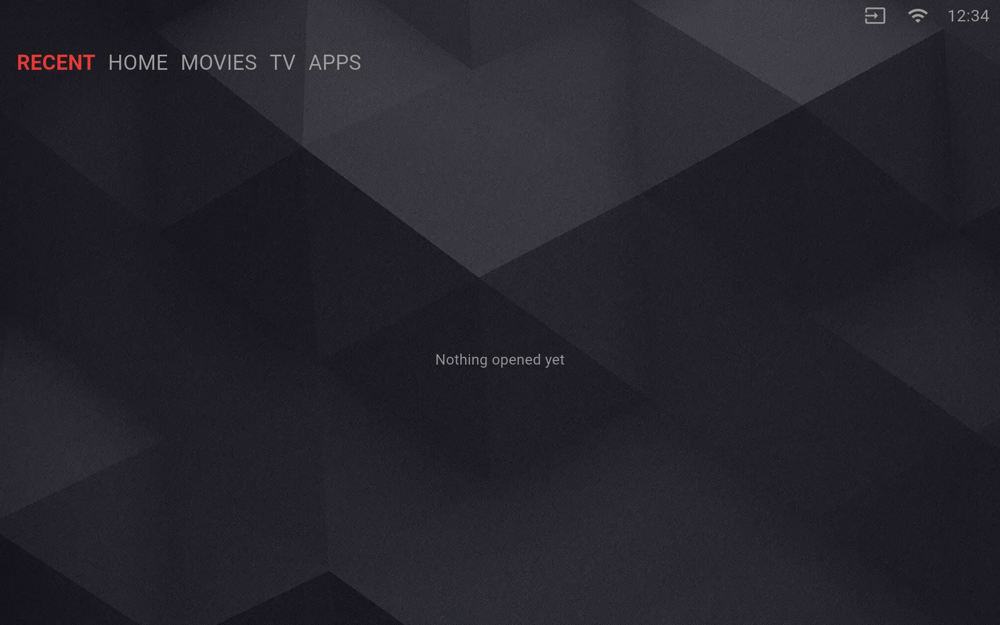
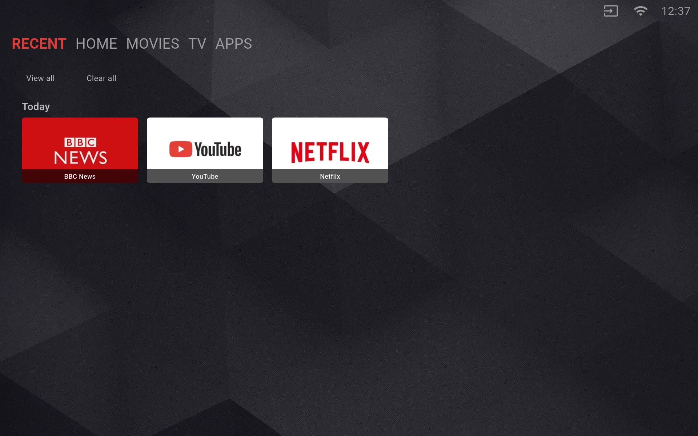
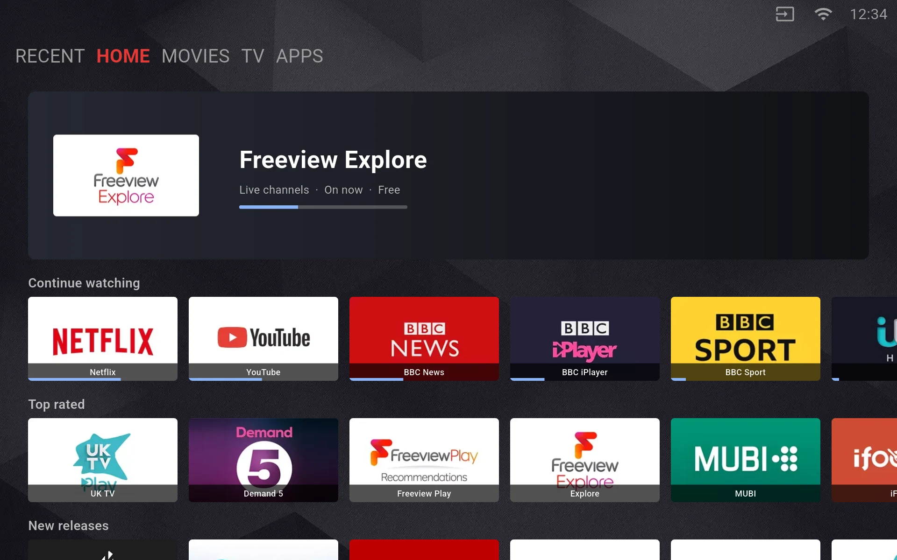
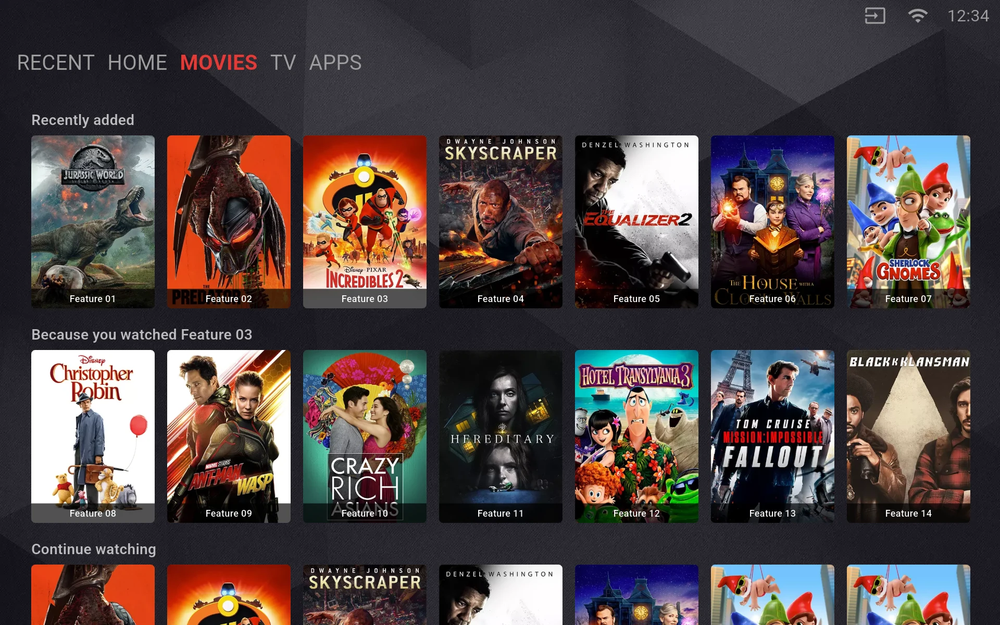
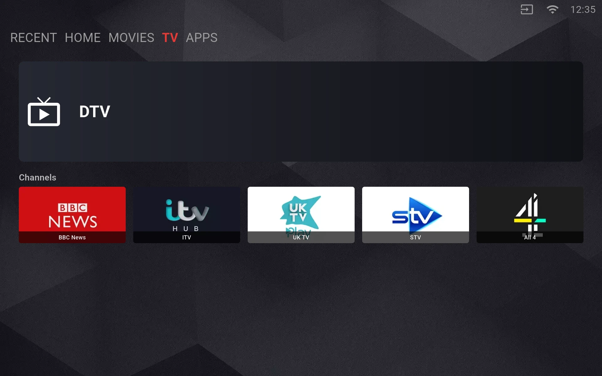
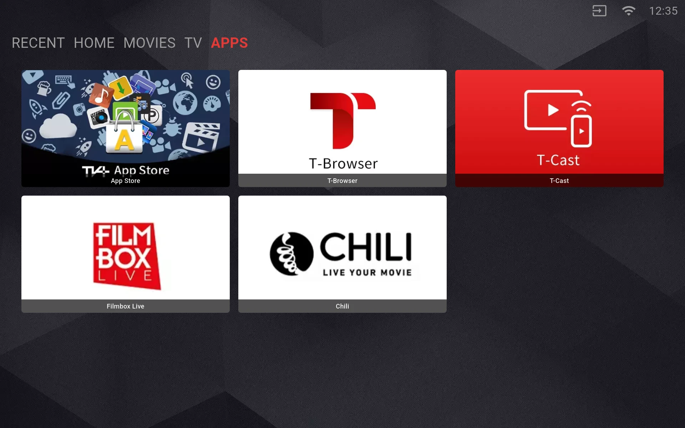

# Flutter TV Launcher

A TV launcher for **Android TV** and **Linux TV OS**, built from one Dart UI
codebase and driven entirely by a remote control.



Home is laid out the way modern TV launchers are: a featured banner above a stack
of horizontally scrolling content rows. Focus movement follows geometry — the
nearest block in the direction the remote was pressed — not widget build order.

The shell carries five tabs, each drawn from its own source:

| Tab | Page | Where its content comes from |
| --- | --- | --- |
| `RECENT` | `PageRecent` | The launcher's own history |
| `HOME` | `PageHome` | `config/home_config.json`, or a layout service |
| `MOVIES` | `PageVideo` | `config/video_config.json`, drawn as portrait posters |
| `TV` | `PageTv` | `config/tv_config.json`, and the platform's tuner where there is one: the hero is the channel on air, with the input's own backdrop when nothing is |
| `APPS` | `PageApps` | `config/app_config.json` |

## Screens

Each tab, as it appears on a television.

| `RECENT` (first run) | `RECENT` |
| :---: | :---: |
|  |  |

| `HOME` | `MOVIES` |
| :---: | :---: |
|  |  |

| `TV` | `APPS` |
| :---: | :---: |
|  |  |

## Version history

| Version | Date | Changes |
| --- | --- | --- |
| 2.0.0 | 2026-10-09 | Reworked into a Google-TV-style launcher on a current Flutter toolchain, with a geometric focus engine, server-driven layouts and a touch-surface remote path. |
| 1.0.0 | 2018-01-04 | Vertical tile grid with a gliding focus box and remote D-pad navigation. |

## Why these two platforms

Television operating systems fall into three families. Only the first two are
addressable with one UI codebase:

| Platform | What it is | Runner | What the platform still has to provide |
| --- | --- | --- | --- |
| Android TV | Google's TV platform — the same platform is also sold under the newer **Google TV** name | `android/` — Kotlin, the v2 embedding, and the banner the TV home screen draws | An implementation of the device channel, plus the app's targets |
| Linux TV OS | A family rather than a product: the Linux stacks television makers build for themselves, and operator frameworks such as RDK | `linux/` — GTK, windowed at the design canvas and undecorated | The same, against the system's own framework |
| tvOS | Apple's television OS, which runs only on Apple TV | — | Closed ecosystem, out of scope |

Both runners are in the repository and both build. What the launcher cannot
supply is the native layer behind the device channels: that is the platform's
own system software, and the host is what answers the channel.

Because the deliverable spans platforms, the Dart side deliberately contains **no
platform-specific code**:

- Key handling reads *logical* keys, never scan codes, so one code path serves
  both platforms.
- Device services go through method channels that each host implements — Kotlin
  on Android, and the GTK runner on Linux. Where no host answers, every call
  returns a neutral value and the launcher still runs, which is what makes a
  desktop a usable development target.

## Project layout

```
lib/
  main.dart                        Entry point for the launcher's own run
  app.dart                         The app widget a deployment composes
  flutter_tv.dart                  The library a deployment imports
  bootstrap.dart                   Integration hook; a no-op by default
  util/
    app_theme.dart                 Focus accent and dark theme
    constant.dart                  Design canvas, focus zones, tab ids, asset paths
    nav_key.dart                   Logical key -> NavKey mapping
    remote_gesture.dart            Touch-surface drag -> NavKey steps
    display_mode.dart              Landscape lock and immersive system UI
    focus_style.dart               Focus highlight mode
    screen_util.dart               Design-to-screen scaling
    scroll_behavior.dart           No overscroll glow: a remote cannot fling
    translations.dart              JSON-backed i18n with English fallback
    locale_catalog.dart            The languages a deployment may be asked for
    grid_metrics.dart              Grid cells -> design-canvas geometry
    json_value.dart                Tolerant JSON readers
  model/
    common/poster.dart             Tile model (title, subtitle, progress)
    home/home_layout.dart          Rows, metrics and the featured banner
    home/home_model.dart           Bundled and remote layout sources
    app/app_catalog.dart           Applications the apps tab offers
    video/video_catalog.dart       Rows the video tab offers
    tv/tv_catalog.dart             Channels the TV tab offers, and their targets
    recent/history_entry.dart      One thing the viewer opened
    recent/history_store.dart      Where that record is kept
    recent/recent_model.dart       Grouping it by kind and by day
    recent/history_recorder.dart   Writing down what was opened
    layout/layout_action.dart      Where a tile leads
    layout/layout_title.dart       A caption and whether to draw it
    layout/layout_resource.dart    The artwork behind a block
    layout/layout_block.dart       A block: grid span, neighbours, resources
    layout/layout_tab.dart         A tab: a titled grid of blocks
    layout/layout_column.dart      A paginated, titled band of blocks
    layout/layout_template.dart    The structure payload, and merging content
    layout/layout_content.dart     The artwork payload
    layout/layout_home_mapper.dart Grid layout -> rows and an optional banner
    layout/layout_source.dart      Layout service access and column paging
    layout/page_result.dart        One page of a paginated list
    layout/action_router.dart      Resolves an action, locally or through the host
    local/platform_bridge.dart     App launching, network, host language
    local/remote_input.dart        Continuous input from a remote surface
    local/device_services.dart     The device port every platform implements
  viewmodel/
    base/view_model.dart           ViewModel contract and provider
    main/main_view_model.dart      Selected tab index
    home/home_view_model.dart      Feed loading, paging and launching
    video/video_view_model.dart    The video catalog
    tv/tv_view_model.dart          The tuner, read from the platform
    app/apps_view_model.dart       The app catalog
    recent/recent_view_model.dart  The history the recent tab draws
  view/
    focus/focus_block.dart         The focusable-block contract
    focus/spatial_focus_engine.dart Geometric focus search
    main/page_main.dart            Shell: key routing and zone focus
    widget/                        Focus block, focus box, clock, title,
                                   status bar, tile, content row, banner
    home/page_home.dart            Featured banner + content rows
    recent/page_recent.dart        History, grouped into today and earlier
    recent/page_recent_all.dart    The full record, with delete
    recent/recent_tile.dart        A history entry, and its delete mark
    video/page_video.dart          Catalog-driven rows of titles
    tv/page_tv.dart                The channel on screen, and the channel list
    app/page_app.dart              Tall tile plus a grid, from the app catalog
android/                           Android TV runner, and the host channel
linux/                             Linux TV runner (GTK), undecorated
config/home_config.json            Home rows, metrics and featured banner
config/app_config.json             Applications
config/video_config.json           Video rows
config/tv_config.json              Channels, and the input they are on
locale/{en,zh}.json                Translations
images/backgrounds/                The page wallpaper
images/posters/                    Portrait artwork for the video tab
images/channels/                   Channel marks, drawn landscape
images/apps/                       Application marks
images/sources/                    Input source marks and status bar icons
art/                               The demo animation and the per-tab screen captures
```

## Architecture

The app is a plain MVVM stack, and the one rule that holds it together is that
dependencies point one way only: a `view` reads a `viewmodel`, and a `viewmodel`
reads a `model`. Nothing reaches upward — no model imports a viewmodel, no
viewmodel imports a widget — so each layer can be read, reasoned about and tested
on its own.

| Layer | Holds | Examples |
| --- | --- | --- |
| `model` | Data, the sources it comes from, and the host bridge | `HomeLayout`, `LayoutTemplate`, `DeviceServices` |
| `viewmodel` | Screen state and the actions that screen performs | `HomeViewModel`, `RecentViewModel` |
| `view` | Widgets, and nothing else | `PageHome`, `ContentRow` |
| `util` | Leaf helpers that belong to no layer | `GridMetrics`, `Json`, `ScreenUtil` |

The focus engine sits under `view` because it is driven by geometry alone: it
reads the `FocusBlock` contract and the render tree, holds no widget state, and
is unit-tested with plain rectangles.

## How focus works

Three zones live in `LaunchMainPage`, and exactly one holds the focus at a time:

| Zone | Moves within | Leaves on |
| --- | --- | --- |
| Status bar | left / right | down to the titles |
| Titles | left / right, which switches tab | up to the status bar, down into the content |
| Content | spatial search in four directions | up to the titles, left / right switches tab |

Selecting acts in whichever zone holds the focus. A content block opens its target;
a status bar entry asks the host to open the surface it stands for, so the input
source and the network menu lead somewhere instead of being a dead end. The title
row is a position rather than a control, so selecting it is absorbed.

Inside the content zone the engine scores candidates by geometry:

1. Drop every block that is not strictly in the pressed direction
   (`SpatialFocusEngine.candidatesInDirection`).
2. Prefer the candidates that also overlap the focused block across the direction
   axis — sideways moves stay in the row, vertical moves stay in the column.
3. Take the candidate whose facing edge midpoint is closest
   (`SpatialFocusEngine.distanceSquared`).
4. If nothing overlaps, fall back to the plain nearest candidate so the focus can
   never get stuck on a row.
5. If nothing qualifies at all, the focus is at the edge: the shell scrolls,
   returns to the titles, or switches tab.

The engine only depends on the `FocusBlock` contract, so it holds no widget state
and is unit-tested with plain rectangles.

Two details worth knowing:

- **Blocks are collected per tab.** The shell walks the subtree of the *active*
  tab page only, so blocks belonging to tabs that `IndexedStack` keeps alive never
  join the search space.
- **Rows and tiles are built eagerly.** The search reads the element tree, so a
  tile that was never built would be unreachable. A row holds a handful of tiles,
  which makes that free.

## Scrolling

Scrolling follows the axis of the key press: sideways moves scroll the row the
tile belongs to, vertical moves scroll the page. Both bounds are taken from the
scroll view's own render box rather than from the screen, because the home tab
keeps a banner above the scrolling region.

## Focus highlighting

All three are supported and switched from one place —
`_LauncherShellState._highlightStyle` in `lib/app.dart`:

| Mode | Behaviour |
| --- | --- |
| `border` | The focused block draws its own border. |
| `overlay` | The block is untouched and a focus box glides over it. |
| `both` | Border plus the gliding box. |

## Key handling

`lib/util/nav_key.dart` maps `LogicalKeyboardKey` values to a small `NavKey` enum.
Logical keys are used because a remote's D-pad reports the same logical keys on
every platform, whereas scan codes are platform-specific and Android-only concepts
have no meaning on a Linux TV OS.

`KeyRepeatEvent` is a distinct type from `KeyDownEvent`, so held keys are ignored
without any explicit repeat filtering.

Back walks the zones homewards rather than leaving immediately: out of the
content, then off the status bar, then out of the launcher. The title row is the
home position, so the last step has nowhere left to go inside the launcher and is
handed to the host instead of being absorbed — what leaving a launcher means is a
question only the platform can answer.

### Remotes without a D-pad

A remote that reports *where* it was touched rather than which key was pressed
cannot arrive on the key channel, so it has a path of its own:
`tv_launcher/remote` carries `{phase, x, y}` and `RemoteInput` turns it into a
stream. `RemoteGestureTranslator` reads a drag as a run of presses — the
direction the finger travels is the direction sent, and a press is emitted once
the finger has travelled one step from wherever the last press was sent:

- Re-anchoring after every press lets one long drag cover several blocks, and
  lets a reversal be acted on at once instead of first undoing the distance
  already travelled.
- The step is `kRemoteGestureStep` design units, scaled to the real surface, so
  a drag costs the same effort at any resolution.
- The axis is decided per press by whichever direction the finger has travelled
  furthest, so a diagonal drag stays predictable.

Both paths meet in one place — `LaunchMainPage._dispatch` — so a zone never knows
whether the viewer used a D-pad or a touch surface. A host that answers no such
channel simply never sends a message.

## Display

A television has one posture and no system chrome the viewer wants to see, so
`TvLauncherApp` holds the landscape orientation and asks the platform to keep its
own status and navigation bars out of the way, before the first frame. On Android
the activity is also pinned to landscape in the manifest, so the frame the
platform draws while the engine starts is already the right shape.

Both calls are framework calls. A platform with no notion of either — a desktop
session, a development target — ignores them and the window is left as the runner
opened it. `applyTvDisplayMode` is exported for a deployment that wants it applied
earlier in its own start-up.

## Layout configuration

Home is fully described by `config/home_config.json` — the featured banner, the
row metrics (tile size, spacing, heading height) and each row's tiles. The
widgets place tiles from those metrics, so layout changes never require touching
widget code.

Set `kRemoteLayoutConfig` in `lib/util/constant.dart` to fetch the layout from a
server instead; `HomeViewModel` falls back to the bundled config whenever the
remote is unreachable or malformed.

## Recent history

The launcher remembers what the viewer opened, because on a television that is
how a title gets resumed. `HistoryStore` keeps the record — one entry per line,
so a partial write costs one entry rather than the whole record.

The store is a single instance rather than one per screen, because the history is
a single thing: the tab that records an entry and the tab that draws it are
different screens looking at the same list. `HistoryRecorder` is the one place
that writes to it, and every view model that can open something records through
it, so a tab cannot open a tile without the record hearing about it. The recent
tab reloads when it comes back into view, which is when the record may have grown
while it was off screen.

An identifier is derived from the title rather than from the tile's position, so
the same title opened twice replaces its entry instead of stacking up, and a
layout that moves a tile does not lose its history.

Where the file goes is the host's to say, through `PlatformBridge`, because which
directory is writable and survives a restart is a property of the platform. A
host that names none leaves the record in memory, so the launcher runs the same
way either way and only the persistence differs.

`RecentModel` is what turns that record into something a viewer can read. It
groups entries two ways at once: by kind, because an application is not a title,
and by day, because what was on this morning is not what was on last week.

## Server-driven layouts

The bundled config is enough for a fixed home tab. A service can also drive the
whole layout, which is how a deployment changes what a viewer sees without
shipping a new build. Three payloads make that up, and they arrive separately so
the structure can be cached while the artwork changes:

| Payload | Holds | Model |
| --- | --- | --- |
| Template | The tabs, and the blocks on each tab's grid | `LayoutTemplate` |
| Content | The artwork and the target for each block | `LayoutContent` |
| Column | One page of a tab's growing bands | `LayoutColumn` |

A tab is a grid: every block carries the cells it covers, so a layout is
resolution-independent. `GridMetrics` turns those cells into design-canvas
geometry, and the tab owns the cell size and gap that its blocks share.

The home page draws rows under a banner rather than a grid, so
`LayoutHomeMapper` is the single place where the two shapes meet:

- The widest block of the top grid row becomes the banner.
- The blocks of each further grid row become one row, headed by the tab caption.
- Each column becomes one more row, headed by the column's own caption.
- Every block keeps its target, so a tile stays selectable by its own action
  rather than by its caption.

Columns are paged. Reaching the end of the rows area pulls the next page in and
appends it, and the page number is kept so that a failed request can be retried
instead of ending the list early.

Set `kRemoteLayoutBaseUrl` to the host's layout service to switch this on. While
it is empty the app draws the bundled config and never calls out, and any
failure — offline, unreachable or malformed — falls back to the bundled config,
so the tab always renders.

## Host integration

`PlatformBridge` talks to the host over the `tv_launcher/platform` channel:

| Method | Purpose |
| --- | --- |
| `launchApp` | Start the application identified by an action string. |
| `launchTarget` | Open a layout target: an action name, a component or a URI. |
| `isNetworkAvailable` | Gate the remote layout fetch. |
| `getCurrentLanguageCode` | Sent with every layout request, and used when the host drives the locale. |
| `storageDirectory` | A directory the launcher may keep its history in, or empty for none. |

The status bar hands the host two named actions and never interprets them:
`open_input_source` and `open_network_settings`. What an input picker or a network
menu is stays with the platform, in the same way a tile never carries a list of
target names.

Every call degrades to a safe default when the host does not implement it, so the
app runs on a plain desktop for UI work. `android/.../MainActivity.kt` implements
the channel on Android, resolving a target by component, then URI, then name. The
Linux runner is the shell only: `linux/runner/my_application.cc` opens the window
and starts the engine, and the channel is left to the deployment, because on a
TV OS it is the system's own framework that answers.

`DeviceServices` is the second channel, `tv_launcher/device`, and carries what a
television can do that a desktop cannot. It is grouped by what it touches:

| Group | Examples |
| --- | --- |
| Input | `inputSource`, `setInputSource`, `isSourceInserted`, `signalState` |
| Picture | `screenMode`, `setBacklight`, `panelSize`, `scaleVideoWindow` |
| Sound | `isTeletextOn`, `setTeletext` |
| Network | `networkInfo`, `connectionStatus`, `lastConnectedAccessPoint` |
| Tuner | `currentChannelId`, `channelInfoById` |
| System | `systemTime`, `property`, `setProperty`, `volumeCount`, `country` |
| Identity | `clientType`, `deviceId`, `deviceNumber`, `projectId`, `launcherId` |

The identity group is what the layout request carries, so a service can answer
the device it is actually talking to. None of it is baked into the launcher: every
value is asked of the host, and a host that answers nothing yields an empty
context, which is a valid request.

`RemoteInput` adds a third channel, `tv_launcher/remote`, for a remote that
reports positions instead of keys; it is described under
[Remotes without a D-pad](#remotes-without-a-d-pad). Like the platform channel it
is implemented by the deployment's own runner, and a host that answers nothing
leaves the launcher on the key path.

`DeviceServices` is only an interface. The implementation belongs to whoever
integrates the launcher, because only they know which services their platform
exposes and what they are called, and it is installed once at start-up:

```dart
void main() {
  DeviceServices.install(const MyPlatformDeviceServices());
  runApp(const TvLauncherApp());
}
```

`lib/bootstrap.dart` is where that call lives. Out of the box it is a no-op, so
the launcher builds, analyzes and tests with no integration present at all, and
every device call answers neutrally.

## Running

```
flutter pub get
flutter run
```

Useful for TV work:

```
flutter run -d <device>          # pick an attached device or emulator
flutter build apk --release      # Android TV package
flutter build linux --release    # Linux TV package (needs a Linux toolchain)
flutter run -d linux             # Linux TV runner, on a Linux host
```

The Linux runner is generated from the Flutter template and then adjusted for a
television: the window is undecorated, so no title bar or close button is drawn
over the launcher, and its default size is the design canvas. Fullscreen is not
forced, because a desktop session is a legitimate way to work on the UI and the
launcher cannot tell the two apart; a TV deployment sets that itself.

> **Windows note:** keep the project under a path containing only ASCII
> characters. Both the Dart analysis server and the Android Gradle plugin fail on
> non-ASCII directories, regardless of the Flutter version.

## Tests

```
flutter test
```

- `spatial_focus_engine_test.dart` — direction filtering, nearest-neighbour
  selection, row/column containment, edge handling, top-row entry points.
- `home_layout_test.dart` — row and banner parsing, derived metrics, tolerant
  parsing of numeric strings.
- `focus_block_widget_test.dart` — border shown per highlight mode, select
  callback, reported bounds.
- `focus_box_alignment_test.dart` — the focus box lands exactly on the tile it
  wraps, with and without a system inset.
- `grid_metrics_test.dart` — cell size and position, spans, unit fractions.
- `layout_models_test.dart` — template, content, column and page parsing,
  merging artwork onto the grid, tolerant types.
- `layout_home_mapper_test.dart` — banner selection, rows from blocks and
  columns, appending a page, undrawable resources.
- `layout_source_test.dart` — request shape, envelope unwrapping, the paging
  walk, and failures reported as null rather than thrown.
- `home_feed_test.dart` — loading from the service, bundled fallback, paging
  to the end, and retrying after a failed page.
- `recent_model_test.dart` — entry round-trips, both stores, day grouping, and
  a corrupt line costing one entry rather than the record.
- `history_recording_test.dart` — opening a tile reaches the record, from any
  tab, and an application is not filed as a title.
- `catalogs_test.dart` — the app and video catalogs, and the locale catalog's
  scripts and regions.
- `tv_catalog_test.dart` — channel parsing and targets, and the tuner tab
  falling back to the bundled list when no platform answers.
- `top_bar_clock_test.dart` — the clock ticks on the minute, and stops when it is
  disposed.
- `device_services_test.dart` — every device call degrading to a neutral answer
  with no host, and action routing.
- `remote_input_test.dart` — drag-to-press translation, message decoding, and
  back walking the zones homewards before it reaches the host.

## Requirements

- Flutter 3.47 or newer (Dart 3.13). The code is fully null-safe and uses Dart 3
  records, switch expressions and pattern matching.

## License

Released under the [Apache License 2.0](LICENSE).

This project is a rework of the original Flutter TV launcher, which is
covered by the same license.
